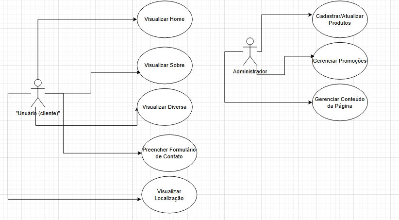

FOTO

  4.1  Descrição de Caso de Uso

Caso de Uso 1: Visualizar Home (Usuário)

Ator: Usuário (Cliente)
Objetivo: O usuário acessa a página inicial do site e visualiza os destaques de produtos, coleções em promoção e novidades da loja.
Descrição:

O usuário acessa a página principal do site.
Ao carregar a Home, o sistema exibe um slideshow com imagens rotativas que mostram:
Produtos em destaque
Promoções atuais
Novidades ou coleções da loja

O usuário pode navegar pelas imagens do slideshow, clicando nas setas para visualizar mais produtos ou informações.
Também há links clicáveis para categorias ou páginas de detalhes de produtos e promoções.
Fluxo de Eventos:
O Usuário abre o site.
O sistema carrega a página inicial.
O sistema exibe o slideshow de produtos e promoções.
O Usuário interage com o slideshow, clicando para ver mais informações.
O usuário pode navegar para outras páginas, como "Coleções" ou "Novidades", clicando em links na Home.
Requisitos Funcionais:
O sistema deve ser capaz de carregar imagens e promoções de forma dinâmica.
O slideshow deve ser interativo e responsivo para diferentes tamanhos de tela.

Caso de Uso 2: Cadastrar/Atualizar Produtos (Administrador)

Ator: Administrador
Objetivo: O Administrador pode adicionar novos produtos ao site ou atualizar as informações de produtos existentes (como preço, descrição, imagens, etc.).
Descrição:
O administrador acessa o painel administrativo do site, onde pode gerenciar os produtos.
Ele pode adicionar um novo produto ou editar os detalhes de um produto já cadastrado.
Ao adicionar um novo produto, o administrador precisa preencher os campos obrigatórios, como nome, preço, descrição, categoria e imagem do produto.
O Administrador também pode atualizar produtos existentes, alterando informações como preço, estoque, descrição, ou adicionar novas imagens.
Fluxo de Eventos:
O administrador faz login no painel administrativo do site.
O administrador escolhe a opção de "Adicionar Produto" ou "Editar Produto".
Caso esteja adicionando um produto:
O Administrador preenche os campos obrigatórios: nome, preço, descrição, categoria e imagem.
Caso esteja editando:
O Administrador atualiza os campos necessários (como preço ou descrição) e salva as alterações.
O administrador salva as mudanças, que são refletidas no site.
Requisitos Funcionais:
O sistema deve permitir ao Administrador adicionar, editar e remover produtos de maneira intuitiva.
O formulário de cadastro de produto deve validar os dados inseridos, como preço (deve ser numérico) e imagem (deve ser no formato correto).
O sistema deve garantir que as alterações sejam salvas corretamente e visíveis no front-end do site.
